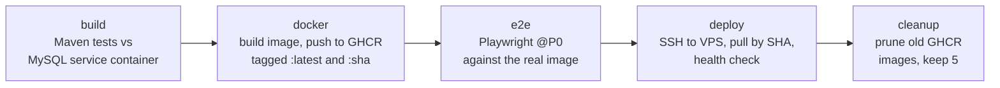

# CareerCompass

[](https://github.com/phatdayne2005/careercompass/actions/workflows/ci.yml)
[](https://openjdk.org/projects/jdk/21/)
[](https://spring.io/projects/spring-boot)
[](docs/coverage/index.html)

A career-orientation and learning-roadmap platform for IT students. Students describe their target role and current skills, and the app builds a personalized learning roadmap, tracks their progress, analyses the gap against real job-market demand, and lets them ask an AI mentor for help along the way.

**Live demo — [careercompass.phatnguyendev.site](https://careercompass.phatnguyendev.site)** · Registration is open, feel free to create an account.

University team project (7 members) for the Java Web Development and Software Testing courses at UTH. Deployed to a VPS with a fully automated CI/CD pipeline.

---

## Table of contents

- [Features](#features)
- [Screenshots](#screenshots)
- [Tech stack](#tech-stack)
- [Architecture](#architecture)
- [Testing](#testing)
- [CI/CD pipeline](#cicd-pipeline)
- [Getting started](#getting-started)
- [Project structure](#project-structure)
- [Documentation](#documentation)
- [Team and my role](#team-and-my-role)

---

## Features

| Module | What it does |
|---|---|
| **Authentication** | Email/password login, Google OAuth 2.0 (OIDC), role-based access control for Student / Counselor / Admin, and password recovery by email with single-use, time-limited reset tokens |
| **Onboarding** | Three-step wizard — pick a target role, choose learning sources, declare current skills. Students can upload an academic transcript, which is parsed to seed their skill profile |
| **Roadmap** | Generates a personalized learning roadmap, tracks per-skill progress through its states, and exports the roadmap to PDF |
| **Skill gap** | Compares the student's current skills against the requirements of their target role and highlights what is missing |
| **AI mentor** | Chat assistant backed by the Google Gemini API, so students can ask questions about the lessons on their roadmap |
| **Market pulse** | Scrapes IT job postings and runs keyword analysis to show which technologies are actually in demand |
| **Portfolio** | Students build a public portfolio page from their completed roadmap, with an editor and a shareable public view |
| **Dashboard** | Per-role dashboards summarising progress and activity |
| **Admin** | User management, counselor roadmap templates, and an admin dashboard |
| **Activity log** | Shared logging service that every other module records user actions through |

---

## Screenshots

<!-- TODO: thay 3 dòng dưới bằng ảnh thật.
     Tạo thư mục docs/screenshots/ rồi commit ảnh vào đó.
     Nên chụp: (1) dashboard, (2) roadmap + skill gap, (3) AI mentor chat. -->

| Dashboard | Roadmap & skill gap | AI mentor |
|---|---|---|
|  |  |  |

---

## Tech stack

**Backend** — Java 21, Spring Boot 4.1, Spring MVC, Spring Security (OAuth2 client + resource server), Spring Data JPA / Hibernate, Bean Validation, Spring Mail, Lombok

**Frontend** — Thymeleaf server-side rendering, HTML/CSS/JavaScript

**Data** — MySQL 8.0

**Libraries** — jsoup (job-posting scraping), commonmark (Markdown rendering), OpenPDF (roadmap PDF export), Jackson

**Testing** — JUnit 5, Mockito, Spring Security Test, MockMvc, JaCoCo, SonarQube scanner · CodeceptJS + Playwright for E2E

**Infrastructure** — Docker, Docker Compose, GitHub Actions, GitHub Container Registry, Nginx reverse proxy, Let's Encrypt, Ubuntu VPS

---

## Architecture

Layered Spring Boot monolith, organised by feature module rather than by technical layer — each module owns its own controllers, services, repositories and entities.

```
Browser
   │
   ▼
Nginx (TLS termination, reverse proxy on the host)
   │
   ▼
Spring Security filter chain  ──►  Controller  ──►  Service  ──►  Repository
                                        │                             │
                                        ▼                             ▼
                                   Thymeleaf view                  MySQL 8.0
```

External integrations: Google OAuth 2.0 for sign-in, Gmail SMTP for password-reset mail, and the Google Gemini API for the AI mentor.

The app container listens only on `127.0.0.1`; Nginx on the host is the only process exposed to the internet.

---

## Testing

Testing is a first-class part of this project rather than an afterthought — it was built alongside a Software Testing course, so the suite deliberately demonstrates formal black-box test-design techniques as executable tests.

| | |
|---|---|
| Test classes | **45** |
| Line coverage | **72.6%** |
| Branch coverage | **65.1%** |
| Method coverage | **75.6%** |

Full JaCoCo report: [`docs/coverage/index.html`](docs/coverage/index.html)

**Black-box techniques applied**

- **Boundary Value Analysis** — standard (`4n+1`) and robustness (`6n+1`) test sets over the registration form, following the rule that each case puts exactly one variable at a boundary while the others stay at nominal values. This suite found a real defect: the `email` field declared only `@Size(max = 150)` with no lower bound, so a three-character value like `a@b` passed validation. The DTO was corrected to `@Size(min = 6, max = 150)`.
- **Equivalence Partitioning** — one representative per class, including classes the boundary suite cannot reach. For example an all-whitespace password has a valid *length* but must still be rejected by `@NotBlank`, which no length boundary would catch.
- **Decision Table** and **State Transition** testing over roadmap progress and token validity.

**End-to-end UI tests** — CodeceptJS driving Playwright, using the Page Object Model, covering auth, onboarding, dashboard, roadmap, skill gap, profile, admin and security flows. Tests are tiered by tag: `@P0` smoke runs on every deployment, `@P1` is the wider regression set, and `@known-bug` is quarantined so documented open defects do not block releases. See [`e2e/README.md`](e2e/README.md).

```bash
./mvnw verify                 # unit + integration tests, then the JaCoCo report
cd e2e && npm run test:p0     # E2E smoke suite (needs the app running)
```

---

## CI/CD pipeline

Every push runs the test suite. Only `main` builds, verifies and releases — and a failed stage leaves the previous version serving.



Design decisions worth calling out:

- **Images are tagged by commit SHA**, not just `latest`, so the VPS always deploys an exact known version and a rollback is a one-line change.
- **The image is built in CI, not on the VPS** — the server only pulls, which keeps a small VPS from spending its RAM on Maven and Docker builds.
- **E2E runs against the very image that will be deployed** and gates the deploy step, so a broken UI never reaches production.
- **`concurrency: cancel-in-progress`** stops two rapid pushes from running overlapping deploys.
- **A post-deploy health check** polls the app and fails the job (with logs) if it does not return HTTP 200.

Setup instructions for the deploy keys and repository secrets are in [`DEPLOY.md`](DEPLOY.md) §10.

---

## Getting started

**Requirements:** Docker and Docker Compose. Nothing else — no local Java or MySQL needed.

```bash
git clone https://github.com/phatdayne2005/careercompass.git
cd careercompass

cp .env.example .env
# Edit .env: set DB_PASSWORD and the seed account passwords.
# Google OAuth, Gmail SMTP and Gemini keys can stay as "mock" —
# the app runs fine without them, only those features are disabled.

docker compose up -d --build
```

Open <http://localhost:8080>. The database schema is created on first start and the seed accounts from `.env` are inserted.

> If your machine already runs MySQL on 3306, set `DB_PORT=3307` in `.env`.

To run the app directly with Maven instead, start a MySQL instance and use `./mvnw spring-boot:run`.

---

## Project structure

```
src/main/java/vn/uth/careercompass/
├── config/         Cross-cutting Spring configuration
├── kernel/         Auth, users, roles, activity log, email, Markdown
├── onboarding/     Onboarding wizard, transcript parsing
├── roadmap/        Roadmap generation, progress, skill gap, PDF export
├── mentor/         AI mentor (Gemini client)
├── marketpulse/    Job-posting scraping and keyword analysis
├── portfolio/      Public student portfolio
├── dashboard/      Role dashboards
├── profile/        Profile and settings
└── admin/          User management, counselor templates

src/test/java/…/blackbox/   BVA, equivalence partitioning, decision table, state transition
src/test/java/…/bva/        Additional boundary-value suites
e2e/                        CodeceptJS + Playwright UI tests
docs/coverage/              JaCoCo HTML report
.github/workflows/ci.yml    CI/CD pipeline
```

---

## Documentation

| Document | Contents |
|---|---|
| [`DEPLOY.md`](DEPLOY.md) | Full VPS deployment guide — Docker, Nginx, HTTPS, firewall, CI/CD secrets, rollback |
| [`e2e/README.md`](e2e/README.md) | Running and writing the end-to-end UI tests |
| [`docs/coverage/`](docs/coverage/) | JaCoCo coverage report |
| `SRS-CareerCompass-v1.0.docx` | Software requirements specification |
| `BaoCao_KiemThu_CareerCompass.docx` | Test report |

---

## Team and my role

Built by a team of 7 students. I was the **team leader and a backend developer**, and was directly responsible for:

- The authentication and authorization module — Spring Security configuration, email/password login, Google OAuth 2.0, role-based access control, and password recovery over SMTP
- Backend services for user management, user profiles, and the shared activity-logging service used by the other modules
- Entity relationships and the MySQL schema
- Containerisation and deployment to the Ubuntu VPS behind Nginx with HTTPS, plus the automated deployment stage of the CI/CD pipeline
- Boundary Value Analysis and Equivalence Partitioning test suites for the registration and onboarding forms

The remaining feature modules were built by other members of the team.

---

## License

Educational project, released for learning and portfolio purposes.
